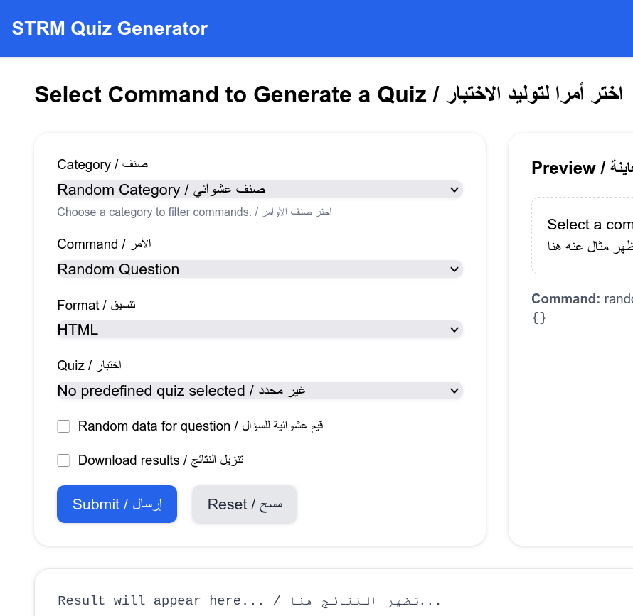

# STRM Tests

Create random tests for **Structure Machine 1 & 2** – First Year MI, Mathematics & Computer sciences in Algerian universities. 

This subject is available for other branches such as: 

* Electrical and mechanical engineering in colleges or universities


توليد الفحوص والأسئلة في مادة "بنية الآلة 1 و2" لشعبتي الرياضيات والإعلام الآلي في الجامعة الجزائرية.

هذه المادة متوفرة أيضا في شعب الهندسة الكهربائية والميكانيكية في الثانويات والجامعات.

---

## مزايا / Features

* توليد الفحوص والأسئلة مع الحلول / Generate tests with solutions
* تدعم الفصول الآتية / Covers topics:

  * أنظمة التعداد / Number systems
  * تمثيل الأعداد الطبيعية والحقيقية والحروف / Representation of integers, floats, and characters
  * ترميز المعلومات / Information encoding
  * الجبر البولياني / Boolean algebra
* تولّد الأجوبة / Generates answers:

  * إمكانية رسم مخطط دالة منطقية / Draw logic function diagrams
  * توليد جداول كارنوف / Generate Karnaugh maps
  * توليد الحلول البيانية لجدول كارنوف / Generate graphical solutions for Karnaugh maps
* توليد نماذج مكررة من الأسئلة لتسهيل الطباعة / Generate repeated versions for printing
* توليد عشوائي للأسئلة / Randomized question generation

**Developer:** Dr. Taha Zerrouki – [tahadz.com](http://tahadz.com), [taha.dot.zerrouki@gmail.com](mailto:taha.dot.zerrouki@gmail.com)


---

## Project Info

| Feature  | Value                                                        |
| -------- | ------------------------------------------------------------ |
| Authors  | Taha Zerrouki – [tahadz.com](http://tahadz.com), [taha.dot.zerrouki@gmail.com](mailto:taha.dot.zerrouki@gmail.com) |
| Release  | 0.3                                                          |
| License  | [GPL](https://github.com/linuxscout/strm-tests/blob/master/LICENSE) |
| Tracker  | [Issues](https://github.com/linuxscout/strm-tests/issues)    |
| Website  | [GitHub](https://github.com/linuxscout/strm-tests)           |
| Source   | [GitHub](https://github.com/linuxscout/strm-tests)           |
| Feedback | [Comments](https://github.com/linuxscout/strm-tests/issues)  |
| Accounts | [X/Twitter](https://x.com/linuxscout)                        |

---

## Requirements

**To run tests:**

* pip install -r tests/requirements.txt

**To produce LaTeX/PDF:**

* Linux command line `make`
* LaTeX (`texlive`)

**To launch Web UI:**

* fastapi
* pip install -r web/requirements.txt

---

## Quick Start

### Web interface

```bash
uvicorn app:app --reload
```

or 

```shell
make server
```


### Console generation:

please see Makefile for more commands

```bash
make test1
make test2
make test3
```

Generates LaTeX files in the `tmp/edits/` folder.

### Examples of  generated quizzes:

- [HTML](docs/examples/example-quizzes.html)
- [Markdown](docs/examples/example-quizzes.md)
- [Latex/PDF](docs/examples/example-quizzes.pdf)
- [Text](docs/examples/example-quizzes.txt)

### Web screen shots:



---

## Project Structure

```
strm-tests/
│
├─ strmquiz/                 # Core Python modules
├─ templates/                # Jinja templates for LaTeX/HTML and future formats
├─ web/                      # web server based on fastapi
├─ tmp/edits/                # Generated LaTeX/PDF  or HTML outputs
└─ tests/                    # Unit tests
   └─config/                   # Sample config files
     └─ quiz.conf
```

---

## Question Type Reference / أنواع الأسئلة

| Category / الفئة             | Command / الأمر | Explanation / الشرح                                          |
| ---------------------------- | --------------- | ------------------------------------------------------------ |
| Codage / الترميز             | `base`          | Convert between numeral bases / تحويل بين أنظمة التعداد      |
| Codage / الترميز             | `arithm`        | Make arithmetic calculus between bases / إجراء العمليات الحسابية بين الأنظمة |
| Codage / الترميز             | `mesure`        | Conversion between measure units / تحويل بين وحدات القياس المختلفة |
| Codage / الترميز             | `float`         | Floating-point representation (IEEE-754) / تمثيل الأعداد العشرية العائمة IEEE-754 |
| Codage / الترميز             | `intervalle`    | Integer intervals with VS, complement 1 & 2 / فواصل الأعداد الصحيحة باستخدام VS، المكمل 1 و 2 |
| Codage / الترميز             | `complement`    | Complement to one and two / المكمل إلى واحد واثنين           |
| Logic / منطق                 | `exp`           | Simplify Boolean expression / تبسيط التعبير البولياني        |
| Logic / منطق                 | `map`           | Simplify a Karnaugh map / تبسيط جدول كارنوف                  |
| Logic / منطق                 | `map-sop`       | Simplify Karnaugh map using canonical forms / تبسيط جدول كارنوف بالشكل القانوني |
| Logic / منطق                 | `function`      | Study a logical function / دراسة دالة منطقية                 |
| Logic / منطق                 | `static_funct`  | Study function given by canonical form / دراسة الدالة من النموذج القانوني |
| Logic / منطق                 | `multi_funct`   | Draw circuit with multiple functions given by min-terms / رسم دائرة منطقية بعدة دوال باستخدام المينترمز |
| Sequential / المنطق التعاقبي | `chronogram`    | Draw  timing diagram with D, JK, RS flip-flops / رسم مخطط زمني باستخدام القلابات |
| Sequential / المنطق التعاقبي | flip            | Draw  timing diagram with D, JK, RS flip-flops / رسم مخطط زمني باستخدام القلابات |
| Sequential / المنطق التعاقبي | counter         | Draw  timing diagram with registers / رسم مخطط زمني للسجلات  |
| Sequential / المنطق التعاقبي | register        | Draw  timing diagram with counters / رسم مخطط زمني للسجلات   |

---

## Using Config Files / استخدام ملفات الإعداد

You can configure multiple test generations in a config file:
يمكنك استخدام ملف إعداد لتوليد عدة اختبارات:
Example / مثال: `strmquiz/config/quiz_template.conf`  or `tests/config/*` samples

---

## Contribution للمساهمة

Please, refer to :اطلع على دليل التطوير  

 [Development Guide](docs/Contribution.md)


## Web API documentation توثيق الواجهة البرمجية

Please, refer to :اطلع على دليل الواجهة البرمجية  

 [َAPI documentation](docs/api.md)


