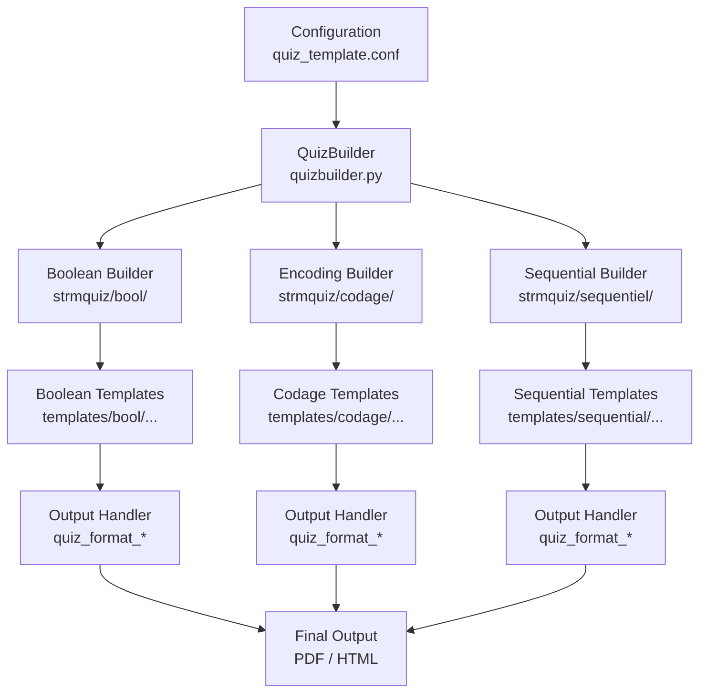
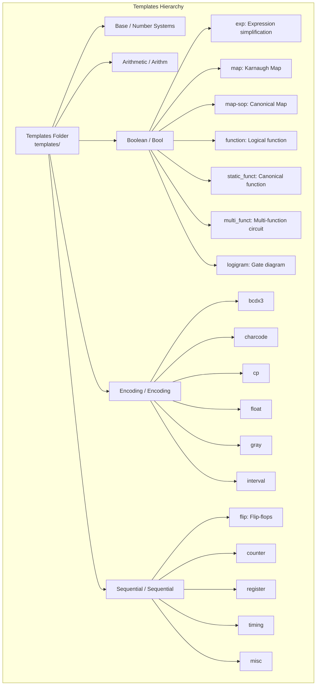

## STRM Tests – Development Guide / دليل التطوير

### 1. Project Overview / نظرة عامة

STRM Tests generates **random exams and questions** for Structure Machine 1 & 2 (First-year  computer science  students).

This subject is available for other branches such as:

* Electrical and mechanical engineering in college or universities

This subject covers the following topics and provides such as features :

* Number systems, encoding, floating-point, Boolean algebra, sequential circuits
* Multiple output formats: latex/PDF, HTML/SVG,

---

### 2. Folder Structure / بنية المشروع

```
strm-tests/
├─ strmquiz/         # Core logic, question builders, factories
├─ templates/        # LaTeX/HTML templates per topic & question type
├─ resources/latex/  # Resources used for generation and GUI style files
├─ scripts/utils/    # Utility scripts (Moodle export, minterms)
├─ tests/            # Unit tests and sample configs
├─ docs/             # Documentation, example PDFs
├─ tmp/edits/        # Generated outputs
├─ README.md
├─ requirements.txt
└─ Makefile
```

---

### 3. Workflow / تدفق العمل



---

### 4. Template & Question Type Hierarchy / هيكلية القوالب وأنواع الأسئلة



---

### 5. Adding a New Question Type / إضافة نوع اختبار جديد

1. Create a new **Builder module** in `strmquiz/`.
2. Add corresponding **templates** in `templates/<topic>/<new_type>/`.
3. Register the builder in `question_builder_factory.py`.
4. Update the **Question Type Reference Table** in README.

---

### 6. Adding a New Output Format / إضافة صيغة إخراج جديدة

1. Implement a new **format handler** in `strmquiz/display/quiz_format_*.py`.
2. Add necessary **template files** for LaTeX/HTML output.
3. Register the format in the **output factory** (`quiz_factory.py`).

---

### 7. Testing / الاختبارات

* Unit tests are in `tests/` with `test_unit_*.py` naming convention.
* Run all tests:

```bash
pytest -v
```

* Sample configs for tests are in `tests/config/`.

---

### 8. Generating Tests / توليد الاختبارات

* **Via GUI:**

```bash
python3 strm_tests_webviewer.py
```

* **Via Makefile:**

```bash
make test1
make test2
```

* **Moodle XML/GIFT export:**

```bash
python3 scripts/utils/genmoodle.py
```

* Generated PDFs/LaTeX files are in `tmp/edits/` or `resources/latex/`.

---

### 9. Logging & Debugging / تسجيل وتصحيح الأخطاء

* Logs are stored in `tmp/logs/`.
* Use `logging` module:

```python
import logging
logger = logging.getLogger(__name__)
logger.debug("Debug info")
```

# Web server

### 🚀 Run the server

```bash
uvicorn main:app --reload
```

Now you have:

- `GET /api/categories` → all categories with short/long descriptions
- `GET /api/commands` → all commands
- `GET /api/commands?category=encoding` → only encoding commands
- `GET /api/random-command` → one random command
- `GET /api/random-commands?n=5&category=boolean algebra` → 5 random boolean algebra commands

------

### 📖 Documents

FastAPI automatically generates **docs** at:

- Swagger UI: http://127.0.0.1:8000/docs
- ReDoc: http://127.0.0.1:8000/redoc

