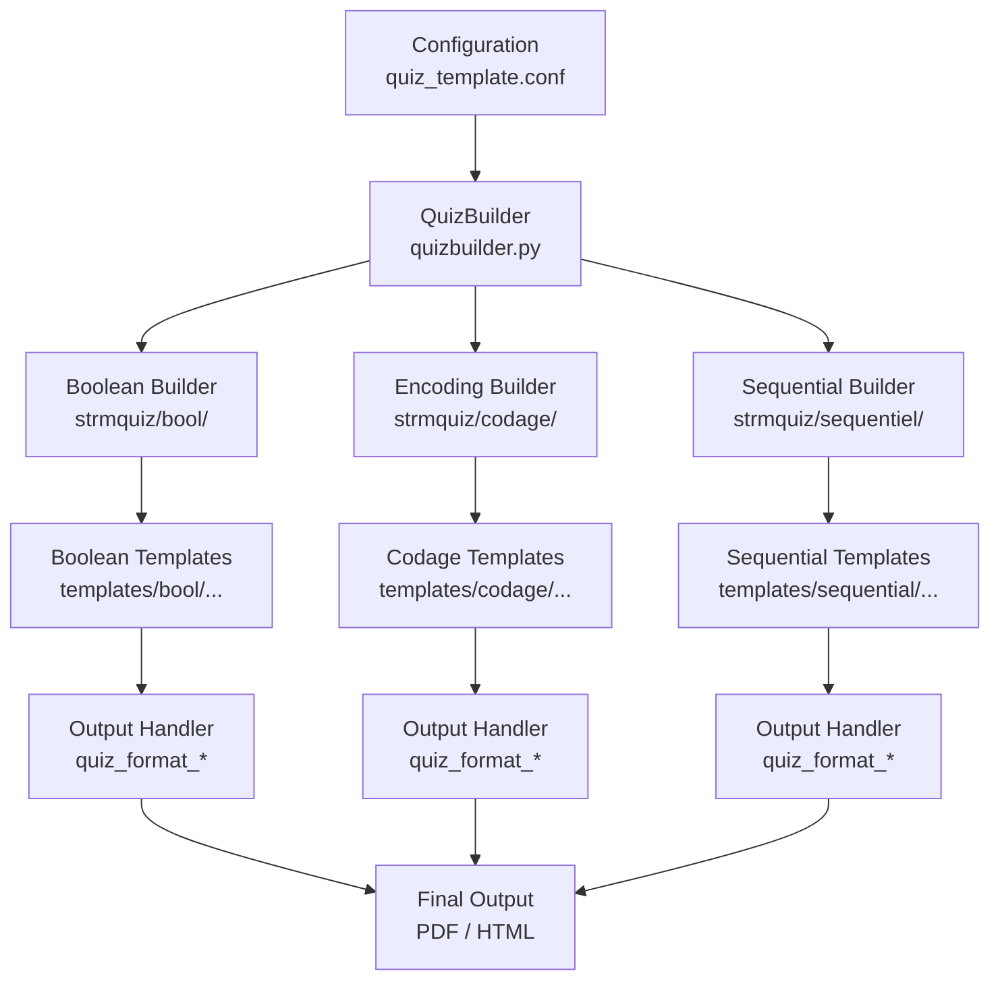
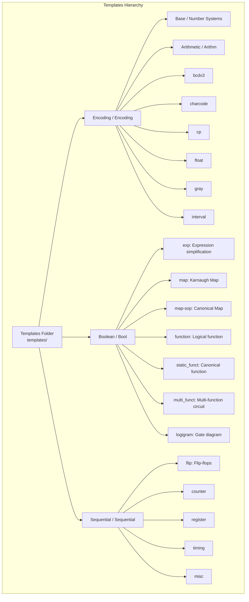
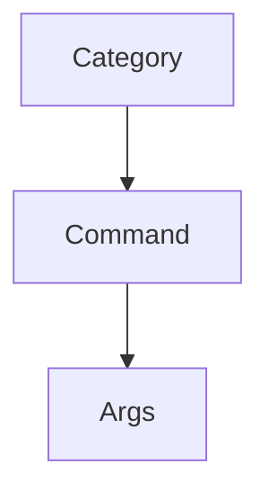

## STRM Tests – Development Guide / دليل التطوير

### 1. Project Overview / نظرة عامة

STRM Tests generates **random exams and questions** for Structure Machine 1 & 2 (First-year  computer science  students).

This subject is available for other branches such as:

* Electrical and mechanical engineering in college or universities

This subject covers the following topics and provides such as features :

* Number systems, encoding, floating-point, Boolean algebra, sequential circuits
* Multiple output formats: latex/PDF, HTML/SVG,

---

### 2. Folder Structure / بنية المشروع

```
strm-tests/
├─ strmquiz/         # Core logic, question builders, factories
├─ templates/        # LaTeX/HTML templates per topic & question type
├─ resources/latex/  # Resources used for generation and GUI style files
├─ scripts/utils/    # Utility scripts (Moodle export, minterms)
├─ tests/            # Unit tests and sample configs
├─ docs/             # Documentation, example PDFs
├─ tmp/edits/        # Generated outputs
├─ README.md
├─ requirements.txt
└─ Makefile
```

---

### 3. Workflow / تدفق العمل



---

### 4. Template & Question Type Hierarchy / هيكلية القوالب وأنواع الأسئلة



---

### 5. Adding a New Question Type / إضافة نوع اختبار جديد

1. Create a new **Question Builder module** in `strmquiz/`.
2. Add corresponding **templates** in `templates/<topic>/<new_type>/`.
3. Register the builder in `question_builder_factory.py`.
4. Update the **Question Type Reference Table** in README.

---

### 6. Adding a New Output Format / إضافة صيغة إخراج جديدة

1. Implement a new **format handler** in `strmquiz/display/quiz_format_*.py`.
2. Add necessary **template files** for the new output format.
3. Register the format in the **output factory** (`quiz_factory.py`).

---

### 7. Testing / الاختبارات

* Unit tests are in `tests/` with `test_unit_*.py` naming convention.
* Run all tests:

```bash
pytest -v
```

* Sample configs for tests are in `tests/config/`.

---

### 8. Generating Tests / توليد الاختبارات

* **Via GUI:**

```bash
uvicorn app:app --reload
```

* **Via Makefile:**

```bash
make test1
make test2
```

* **Moodle XML/GIFT export:**

```bash
python3 scripts/utils/genmoodle.py
```

* Generated PDFs/LaTeX files are in `tmp/edits/` or `resources/latex/`.

---

### 9. Logging & Debugging / تسجيل وتصحيح الأخطاء

* Logs are stored in `tmp/logs/`.
* Use `logging` module:

```python
import logging
logger = logging.getLogger(__name__)
logger.debug("Debug info")
```

# Web server

### 🚀 Run the server

```bash
uvicorn app:app --reload
```

Now you have:

- `GET /api/categories` → all categories with short/long descriptions
- `GET /api/commands` → all commands
- `GET /api/commands?category=encoding` → only encoding commands
- `GET /api/random-command` → one random command
- `GET /api/random-commands?n=5&category=boolean algebra` → 5 random boolean algebra commands

------

### 📖 Documents

FastAPI automatically generates **docs** at:

- Swagger UI: http://127.0.0.1:8000/docs
- ReDoc: http://127.0.0.1:8000/redoc

# 🛠 Adding Categories & Commands

This guide explains how to extend the quiz system with **new categories** and **new commands**.

---

## 📌 System Structure



### Example Tree

```
encoding
 ├── float
 │     └── Arg: float (integer, default=0)
 └── intervalle
       ├── Arg: interval_nbits (integer, default=4, range=1–16)
       └── Arg: signed (boolean, default=false)
```

---

## ✅ Step 1: Add a Category

The definition of new category is related to the creation of new kind of question, as NewTopicQuestionBuilder.

Edit `NewTopicQuestionBuilder.py`:

```python
self.CATEGORY = "logic"
# Predefined categories metadata
self.categories_info = {
    self.CATEGORY: {
    "short": "Logic Circuits",
    "long": "Boolean algebra, truth tables, and gates."
    }
}
```

* **Key** → internal ID (e.g., `"new topic"`)
* **short** → used as label
* **long** → shown as explanation

---

## ✅ Step 2: Add Commands to the Category

Edit `NewTopicQuestionBuilder.py`, to add a new commands, for example "truth table" as new command:

```json
self.commands_info ={
  "truth_table": {
    "category": self.CATEGORY,
    "short": "Truth table generation",
    "long": "Generate a truth table for a Boolean expression.",
    "example": "Draw a truth table for the following expression A+B.",      
    "template": "logic/truth_table",
    "args": {
      "expression": {
        "type": "string",
        "default": "A && B",
        "label": "Boolean Expression"
      }
    }
  }
}
```

* **category** → must match a key in `self.CATEGORY`
* **template** → path to HTML/Tex template (e.g., `templates/logic/truth_table.html`)
* **args** → inputs the UI will render automatically

---

## ✅ Step 3: Create Templates

Example file: `templates/logic/truth_table.html`

```html
<h3>Truth Table</h3>
<p>Expression: {{ expression }}</p>
```

---

## ✅ Step 4: Implement Backend Logic

In your question builder module:

```python
def truth_table_question(expression="A && B"):
    question = f"Build the truth table for {expression}"
    answer = "Expected solution here"
    return question, answer
```

---

## ✅ Step 5: Add configuration

1. Edit default configuration file: `strmquiz/config/quiz.conf`.

2. Add the new question command to a test, 

   1. for example test0=["truth table"]

3. Edit the used config file, for example : `tests/config/quiz7.conf`

4. Edit the default args configuration: `strmquiz/config/args.default.json`:

   1. add args configuraiton:

      ```json
        "truth_table": {
          "expression": "A + B"
        },
      ```

5.  Edit the used args configuration, for example `tests/config/args.default.json`, add the same code.

## ✅ Step 6: Test in the CLI

1. To test as Tex output run:

   ```shell
   make test0
   ```

2. To test as HTML output run:

   ```shell
   make test0h
   ```

## ✅ Step 7: Test in the UI

1. Restart the app
2. Open the **Quiz form**
3. Select your category and command
4. Verify:

   * Args form is generated correctly
   * Preview & Example question appear
   * Submission works

---

## ✅ Step 8: Write Unit Tests

```python
def test_truth_table_command(builder):
    question, answer = builder.get_question(command="truth_table", args={"expression": "A && B"})
    assert "truth table" in question.lower()
    assert answer
```

---

## 📌 Quick Checklist

* [ ] Add category to `NewQuestionBuilder.py`
* [ ] Add command definition in `NewQuestionBuilder.py`
* [ ] Create template file (`.html` or `.tex`)
* [ ] Implement backend question generator
* [ ] Add to configuration files
* [ ] Test in CLI (Tex / HTML output)
* [ ] Test in UI (form + preview + output)
* [ ] Write pytest

---

✅ With these steps, you can extend the system with **entirely new categories** and **commands inside them**.

